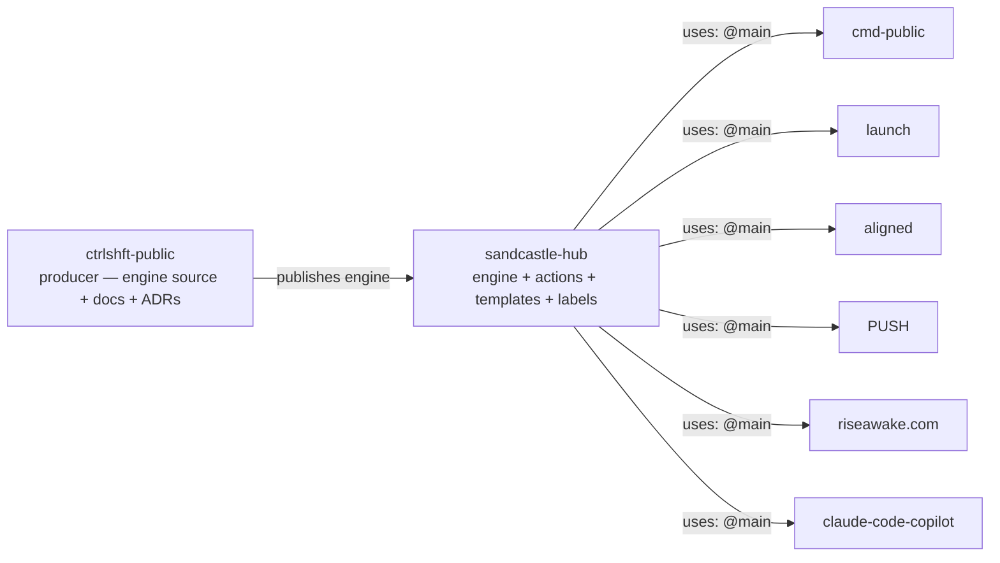

# sandcastle-hub

**Single source of truth for the Sandcastle agent engine.**

Sandcastle runs autonomous coding agents (architecture review, repo hygiene, PRD implementation, PR review, merge, and more) against GitHub repositories. This repo is the **hub**: the one place the engine, templates, and actions live. Consumer repos reference it remotely — nothing is vendored, nothing drifts.

## Architecture



- **`engine/`** — the TypeScript engine (lib, workflows, schemas, `run.ts`, tests). 21 test suites, 336 tests.
- **`templates/`** — prompt templates, extraction templates, scripts, hooks, labels.
- **`actions/agent-run/`** — the single composite action consumers call. It checks out the hub at the pinned ref, installs engine deps, runs the engine against the consumer workspace (`--repo`), and summarizes the run.
- **`.github/workflows/`** — engine CI (tests on every PR) and reusable lifecycle workflows.

> **Producer:** the engine originates in [`arndvs/ctrlshft`](https://github.com/arndvs/ctrlshft) (`shft/engine`), which is published here. Architecture and decision records live in that repo's `docs/` (`sandcastle-hub-architecture.md`, `ADR-008`).

## Consumer usage

A consumer repo keeps `sandcastle.config.json` + thin workflow stubs. Example stub:

```yaml
name: "Agent: Architecture Review"

on:
  schedule:
    - cron: "0 9 * * 1-5"
  workflow_dispatch:

permissions:
  contents: read
  issues: write

jobs:
  architecture-review:
    runs-on: ubuntu-latest
    steps:
      - uses: arndvs/sandcastle-hub/actions/agent-run@main
        with:
          workflow: architecture-review
          ref: main
          token: ${{ secrets.AGENT_PAT || secrets.GITHUB_TOKEN }}
```

The consumer's job-level `env:` supplies model access (`ANTHROPIC_BASE_URL`, `ANTHROPIC_AUTH_TOKEN`, `ANTHROPIC_API_KEY`) and `OUTPUT_DIR` is set by the action.

## Pinning

- Default: `@main` — consumers get engine updates immediately.
- Stability: pin `hub-version.json` to a SHA or `vX.Y.Z` tag and reference that ref in the stub (`ref: <sha>`).
- Drift: the consumer's `sandcastle-drift.yml` compares its pinned SHA to the hub's latest `main` and opens a review PR when stale.

## Development

```bash
cd engine
pnpm install --frozen-lockfile
pnpm test       # 336 tests
pnpm typecheck
```

Engine layout constraint: `engine/` and `templates/` MUST be siblings. `resolveDefaultTemplatesDir` walks `../../templates/prompts` from `engine/workflows/`, and `run.ts` resolves `templates/prompts` from the repo root — both converge on `<repo>/templates/prompts` only when they sit side by side.

## License

MIT
